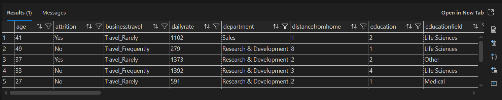
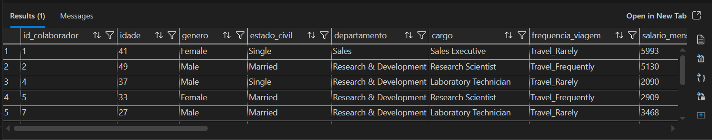
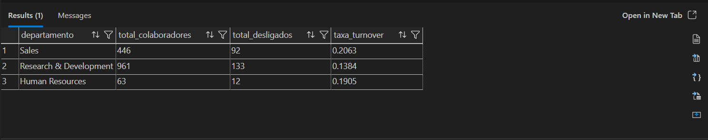
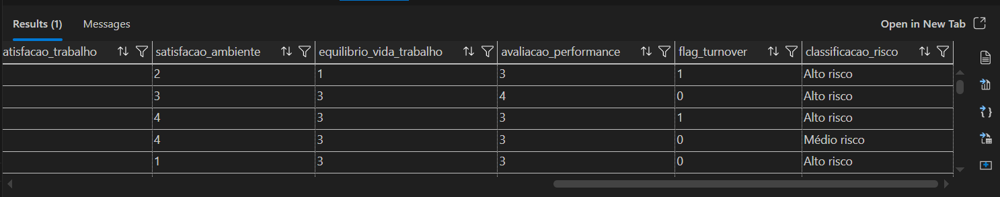

# 📊 People Analytics End-to-End

## 🧠 Visão Geral
Este projeto simula uma solução completa de People Analytics, construída de ponta a ponta, com foco em ingestão, tratamento, modelagem analítica, automação e visualização de indicadores estratégicos de RH.

O objetivo foi demonstrar não apenas análise de dados, mas a construção de um ecossistema analítico estruturado, próximo ao contexto real de grandes empresas.

---

## 🎯 Objetivo
Transformar dados brutos de colaboradores em informações confiáveis e acionáveis para apoiar decisões relacionadas a turnover, retenção e estrutura organizacional.

---

## 🏗️ Arquitetura

```text
Fonte de dados (CSV - Kaggle)
        ↓
Ingestão e tratamento (Python)
        ↓
Armazenamento e modelagem (SQL Server)
        ↓
Camadas analíticas (Bronze → Silver → Gold)
        ↓
Visualização e insights (Power BI)
```

---

## ⚙️ Tecnologias Utilizadas

- Python (pandas)
- SQL Server
- VSCode
- Power BI
- GitHub

---

## 📂 Estrutura do Projeto
```text
data/
├── raw/
│   └── hr_data.csv
├── processed/
│   └── hr_data_clean.csv

docs/
└── dicionario_dados.md

powerbi/
└── prints/
    ├── bronze.png
    ├── silver.png
    ├── gold_turnover.png
    └── risk_profile.png

python/
├── ingestion.py
├── load_to_sql.py
└── analytics/
    ├── predictive_turnover.py
    └── outputs/
        ├── feature_importance.csv
        ├── model_metrics.txt
        └── model_outputs.csv

sql/
├── 01_create_db.sql
├── 02_create_schemas.sql.sql
├── 03_create_bronze.sql
├── 04_create_silver.sql
├── 05_create_gold.sql
├── 06_check_silver_structure.sql
├── 07_create_view.sql
├── 08_create_indexes.sql
├── 09_create_risk_layer.sql
├── 10_final_quality_checks.sql
├── 11_create_dim_tempo.sql
├── 12_create_dim_area.sql
├── 13_create_dim_cargo.sql
├── 14_create_dim_faixa_etaria.sql
├── 15_create_dim_colaborador.sql
├── 16_create_fato_turnover.sql
├── 17_create_fato_headcount.sql
├── 18_validate_star_schema.sql
├── 19_add_foreign_keys.sql
├── validate_bronze.sql
├── validate_gold.sql
└── validate_silver.sql

README.md
requirements.txt
.gitignore
```
---

## 📘 Documentação

- [Dicionário de Dados](docs/dicionario_dados.md)

---

## 🧱 Pipeline de Dados

### 🔹 Bronze
Dados brutos carregados diretamente do CSV.

### 🔹 Silver
Camada tratada com:
- padronização
- regras de negócio
- criação de variáveis analíticas

### 🔹 Gold
Camada analítica com:
- KPIs
- agregações
- tabelas prontas para BI

## 📊 Prints do Pipeline de Dados

### Bronze (dados brutos)


### Silver (dados tratados)


### Gold (KPIs)


### Análise de risco


---

## 📊 Principais Indicadores

- Headcount
- Taxa de turnover geral
- Turnover por área
- Turnover por cargo
- Turnover por faixa etária
- Turnover por tempo de empresa
- Salário médio

---

## 🔍 Principais Insights

- Taxa geral de turnover: **16,12%**
- Área de Sales com maior turnover: **20,63%**
- Cargo com maior risco: **Sales Representative (39,76%)**
- Maior concentração de desligamentos em colaboradores com até **2 anos de empresa (34,88%)**
- Colaboradores com até **29 anos apresentam maior taxa de saída (27,91%)**

---

## 🚨 Análise de Risco

Foi criada uma classificação de risco baseada em:
- tempo de empresa
- satisfação
- carga de trabalho

### Resultado:

| Risco        | Turnover |
|-------------|--------|
| Alto risco  | 20,14% |
| Médio risco | 10,87% |
| Baixo risco | 9,29% |

👉 O modelo demonstra capacidade de segmentação e priorização para ações de retenção.

---

## 💡 Interpretação de Negócio

Os resultados indicam maior vulnerabilidade de retenção em funções comerciais, especialmente entre profissionais mais jovens e com pouco tempo de empresa.

Isso pode indicar necessidade de revisão em:
- processo de contratação
- onboarding
- desenvolvimento de carreira
- gestão de expectativas

---

## 🤖 Modelo Preditivo de Turnover

Foi desenvolvido um modelo de Machine Learning utilizando Regressão Logística para estimar a probabilidade de desligamento dos colaboradores.

### 🎯 Objetivo
Antecipar o risco de turnover e apoiar decisões estratégicas de retenção.

### 📊 Métricas do modelo
- ROC AUC: 0.81
- Accuracy: 86%
- Precision: 61%
- Recall: 34%

### 🔍 Principais fatores de risco identificados
- Cargo (Sales Representative, Laboratory Technician)
- Realização de horas extras
- Alta frequência de viagens
- Tempo elevado desde a última promoção
- Estado civil (Single)

### 🧠 Interpretação
O modelo demonstrou boa capacidade de discriminação entre colaboradores com maior e menor probabilidade de desligamento.

Apesar de um recall mais baixo, o modelo já permite identificar padrões relevantes de risco, sendo um ponto de partida sólido para evoluções futuras com técnicas de balanceamento e tuning.

### 📁 Outputs gerados
- Probabilidade individual de turnover
- Classificação de risco (Alto, Médio, Baixo)
- Importância das variáveis

Arquivos disponíveis em:
`python/analytics/outputs/`

---

## 🧩 Modelo Dimensional

Além da camada analítica agregada (KPIs em Gold), o projeto também conta com um modelo dimensional para suportar análises escaláveis em BI.

### Dimensões
- dim_colaborador
- dim_tempo
- dim_area
- dim_cargo
- dim_faixa_etaria

### Fatos
- fato_turnover
- fato_headcount

Essa estrutura permite consumo analítico tanto por tabelas agregadas quanto por um modelo mais próximo de cenários corporativos de BI.

---

## 📐 Definição de Turnover

Neste projeto, o turnover foi calculado como:

Turnover = Desligamentos / Base total de colaboradores do recorte

Essa abordagem foi adotada devido à ausência de dados de admissões e histórico temporal, evitando distorções causadas pelo uso de headcount ativo como denominador.

---
## 🧠 Diferenciais do Projeto

- Pipeline estruturado (Bronze / Silver / Gold)
- Integração Python + SQL Server
- Modelagem analítica
- Criação de KPIs estratégicos
- Camada de risco de turnover
- Uso de view para consumo analítico
- Validações de qualidade de dados
- Implementação de modelo preditivo de turnover com Machine Learning
- Integração entre camada analítica e modelo preditivo

---

## ▶️ Como executar o projeto

1. Baixar o dataset IBM HR Analytics (Kaggle)
2. Executar o script de ingestão e tratamento:
   - `python ingestion.py`
3. Executar o script de carga no SQL Server:
   - `python load_to_sql.py`
4. Executar os scripts SQL na ordem numérica:
   - criação de database e schemas
   - camada Bronze
   - camada Silver
   - camada Gold
   - validações de qualidade
   - modelo dimensional (dimensões e fatos)
   - foreign keys
5. Executar o modelo preditivo:
   - `python python/analytics/predictive_turnover.py`
6. Importar no Power BI:
   - tabelas analíticas da camada Gold
   - outputs do modelo preditivo

---

## 🚀 Próximos Passos

- Aprimoramento do modelo preditivo (balanceamento de classes e tuning)
- Deploy automatizado do pipeline
- Integração com dados reais de RH
- Expansão para análises temporais (histórico de eventos)
- Deploy em ambiente cloud (GCP / Azure)

---

## 👨‍💻 Autor

Projeto desenvolvido como parte de portfólio em Data Analytics e People Analytics.